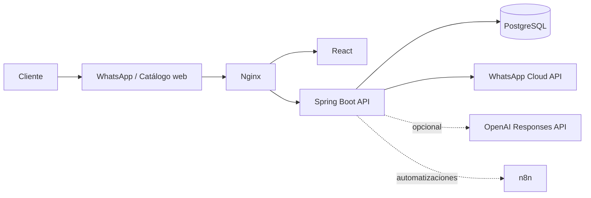
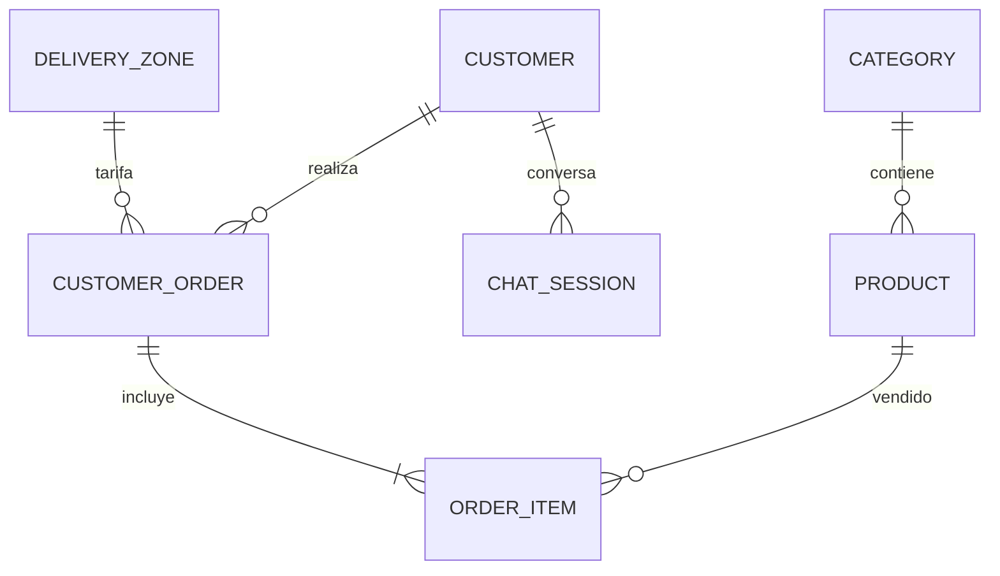

# Arquitectura

## Principios

- El catálogo y stock son la fuente de verdad.
- La IA no puede inventar precio, stock, pedido ni pago.
- Cada pedido guarda precio histórico en `order_items`.
- Al crear un pedido se descuenta stock; al cancelarlo se repone.
- El webhook puede funcionar sin OpenAI mediante flujo determinista.
- Las credenciales se cargan desde variables de entorno.

## Entidades

